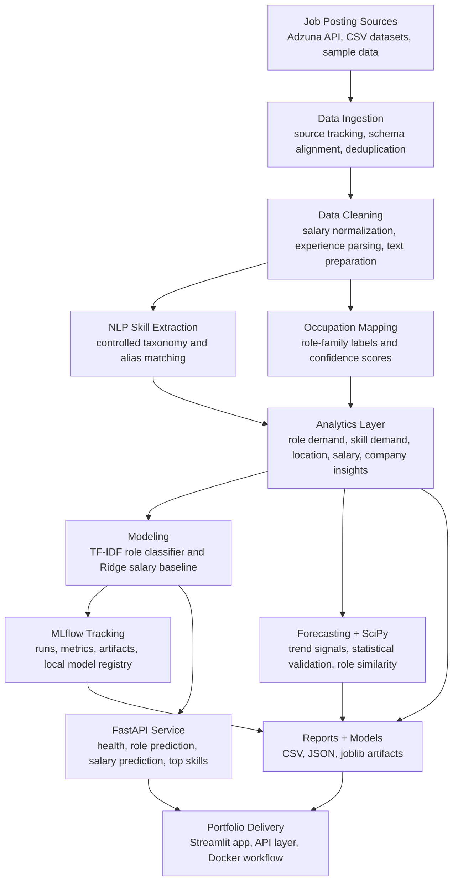

# 🧭 LaborIQ — Labor Market Intelligence Platform

**🚀 Live Application:** [Open LaborIQ v2.0](https://laboriq-v20-pap77tsgkbeqgnfrjmpjsx.streamlit.app/)

**GitHub Repository:** [praveenraj9623-sketch/laboriq-v2.0](https://github.com/praveenraj9623-sketch/laboriq-v2.0)

> Transforms raw job postings into structured workforce intelligence: role demand, skill demand trends, occupation mapping, salary analysis, statistical validation, and directional skill-demand forecasting.

**[Open Live App →](https://laboriq-v20-pap77tsgkbeqgnfrjmpjsx.streamlit.app/)**

[](https://python.org)
[](https://duckdb.org)
[](https://streamlit.io)
[](https://scikit-learn.org)
[](https://scipy.org)
[](https://laboriq-v20-pap77tsgkbeqgnfrjmpjsx.streamlit.app/)
[](https://praveenraj9623-sketch.github.io/)
[](https://github.com/praveenraj9623-sketch/laboriq-v2.0)

---

## Demo Preview

> Demo GIF placeholder: add the new walkthrough GIF here soon.
>
> Suggested path: `assets/laboriq-v2-demo.gif`

---

## What is LaborIQ?

LaborIQ is a labor market intelligence platform that converts raw job postings into structured workforce insights. It analyzes role demand, skill demand, location demand, salary patterns, emerging skill trends, and candidate skill gaps.

The project uses Python, SQL/DuckDB, NLP, SciPy, scikit-learn, Plotly, Streamlit, and Adzuna API integration to deliver a real workforce analytics workflow end to end.

**Core outcome:** raw job postings → cleaned datasets → standardized skills → role families → analytics reports → ML models → statistical validation → dashboard insights.

---

## Why This Project Aligns with Lightcast-style Workforce Analytics

| Lightcast-style capability | LaborIQ implementation |
|---|---|
| Job posting ingestion and source tracking | Adzuna API integration, static data support, source labels, and deduplication workflow |
| Standardized skills taxonomy | Controlled skill vocabulary with alias matching, such as `ML` → `Machine Learning` and `NLP` → `Natural Language Processing` |
| Occupation / role classification | TF-IDF + Logistic Regression across role families |
| Labor demand analytics | DuckDB / SQL-style analytics for role demand, salary, company, location, and skills |
| Skills trend detection | Monthly skill-demand panel with emerging / stable / declining signals |
| Directional demand forecasting | Lag-based / trend-based forecasting logic for skill demand signals |
| Statistical validation | SciPy tests and role-skill similarity analysis |
| Stakeholder-ready reporting | Streamlit dashboard, Plotly visualizations, and exported CSV / JSON reports |

---

## System Architecture

The platform is organized as an end-to-end labor-market intelligence workflow:



This flow shows the full upgrade: raw jobs become cleaned analytical datasets, standardized skills, mapped role families, trained ML models, tracked experiments, API endpoints, and a Streamlit portfolio dashboard.

---

## Tech Stack

| Category | Tools & Libraries |
|---|---|
| **Data Processing** | Python 3.11, Pandas, NumPy, DuckDB |
| **Machine Learning** | scikit-learn, TF-IDF Vectorizer, Logistic Regression, Ridge Regression |
| **NLP** | Custom skill taxonomy, alias matching, unstructured text parsing |
| **Statistics** | SciPy, hypothesis testing, cosine similarity / distance |
| **Forecasting** | Lag features, rolling averages, trend classification, directional forecasting |
| **Visualization** | Streamlit, Plotly, Matplotlib |
| **Data Ingestion** | Adzuna Jobs API, CSV input |
| **Model Artifacts** | joblib model serialization |
| **API Serving** | FastAPI, Uvicorn, Pydantic |
| **Experiment Tracking** | MLflow local tracking and model registry |
| **Dev & Testing** | pytest, GitHub, VS Code |

---

## Module Details

### Module 1 — Labor Market Intelligence & Analytics

This module ingests job postings from API/static data sources, cleans and standardizes fields, removes duplicates, and prepares structured datasets for analytics.

It supports analysis across:

- role demand
- company demand
- location demand
- salary availability and salary patterns
- skill frequency
- data source mix and data quality

### Module 2 — NLP Skill Extraction & Occupation Mapping Engine

This module parses unstructured job description text using a controlled skill taxonomy with alias matching.

Example:

```text
"NLP", "natural language processing", "text analytics"
→ Natural Language Processing
```

It also maps noisy job titles into role families such as:

- Data Scientist
- Data Analyst
- Data Engineer
- AI Engineer
- ML Engineer
- NLP Engineer
- Business Analyst
- Research Analyst

### Module 3 — ML Modeling & Directional Skill-Demand Forecasting

This module trains baseline machine learning models:

| Model | Purpose |
|---|---|
| TF-IDF + Logistic Regression | Predict role family from job posting text |
| Ridge Regression | Baseline salary midpoint prediction using salary-available rows |

It also creates directional skill-demand signals using monthly skill mentions, lag features, rolling averages, and growth patterns.

> Forecasts are directional signals, not guaranteed market predictions. Source coverage, API freshness, sample size, and missing data can affect trend behavior.

### Module 4 — SciPy Statistical Validation Layer

This module validates selected labor-market patterns using statistical methods instead of relying only on charts.

Examples:

| Business question | Statistical method |
|---|---|
| Are salary distributions different across role families? | Kruskal-Wallis / Mann-Whitney U |
| Is skill count associated with salary? | Spearman correlation |
| Are categorical variables associated? | Chi-square test |
| Which roles share similar skill profiles? | Cosine similarity / distance |

> Selected insights are statistically validated; this does not mean every chart proves causation.

---

## Key Outputs

Running the full pipeline generates structured artifacts in `/reports/` and `/models/`.

| Output File | Description |
|---|---|
| `processed_job_postings.csv` | Cleaned postings with standardized fields and role labels |
| `top_skills.csv` | Ranked skill demand frequency across postings |
| `skills_by_role.csv` | Skill demand broken down by role family |
| `skill_trends.csv` | Emerging / stable / declining skill labels |
| `skill_forecasts.csv` | Directional skill-demand forecast output |
| `scipy_insights.csv` or `statistical_tests.csv` | SciPy-based validation outputs |
| `role_skill_similarity.csv` | Similarity between role skill profiles |
| `model_metrics.json` | Role classifier and salary model metrics |
| `source_mix.csv` | Source breakdown across API/static/sample data |
| `role_classifier.joblib` | Saved role classification model |
| `salary_model.joblib` | Saved salary baseline model |

---

## Model Results

| Model | Metric | Result |
|---|---:|---:|
| Role Classifier | Accuracy | ~74.6% |
| Role Classifier | Macro F1 | ~74.2% |
| Role Classifier | Weighted F1 | ~75.6% |
| Salary Model | MAE | ~4.54 LPA |
| Salary Model | R² | ~0.41 |

> Salary model note: the salary model is a portfolio baseline trained only on rows where salary information is available. It should not be treated as a production salary engine without larger, cleaner, validated compensation data.

---

## Live Data Integration — Adzuna API

LaborIQ can use the [Adzuna Jobs API](https://developer.adzuna.com/) for live job ingestion. This gives the project a real-time data layer while avoiding scraping.

### One-time setup

```bash
cp .env.example .env
```

Open `.env` and add:

```text
ADZUNA_APP_ID=your_app_id
ADZUNA_APP_KEY=your_app_key
```

> Never commit `.env` to GitHub.

### Example live data pull

```bash
python scripts/fetch_adzuna.py \
  --queries "data scientist" "data analyst" "machine learning engineer" \
  --location "India" \
  --country in \
  --pages 2 \
  --results-per-page 50
```

Then rebuild reports:

```bash
python pipelines/run_pipeline.py --external data/external/adzuna_jobs.csv
```

The ingestion workflow can include multi-query fetching, deduplication, local caching, and source tracking so the dashboard can show where each record came from.

---

## API Endpoints

LaborIQ now includes a FastAPI service for model-backed predictions and report access.

Start the API locally:

```bash
uvicorn api.main:app --reload --host 0.0.0.0 --port 8000
```

Health check:

```bash
curl http://localhost:8000/health
```

Predict a role family from a job description:

```bash
curl -X POST http://localhost:8000/predict/role \
  -H "Content-Type: application/json" \
  -d "{\"job_description\":\"Build machine learning models with Python, SQL, NLP, dashboards, and stakeholder reporting.\"}"
```

Predict salary midpoint in LPA using the salary model feature schema:

```bash
curl -X POST http://localhost:8000/predict/salary \
  -H "Content-Type: application/json" \
  -d "{\"text_for_model\":\"Python SQL machine learning forecasting dashboards\",\"role_label\":\"Data Scientist\",\"location\":\"Bengaluru\",\"experience_level\":\"Mid\",\"skill_count\":5}"
```

Read the top 20 skills from `reports/top_skills.csv`:

```bash
curl http://localhost:8000/skills/top
```

---

## Experiment Tracking with MLflow

The training code logs local MLflow runs to `mlruns/` by default. Re-run the pipeline to capture experiment metadata:

```bash
python pipelines/run_pipeline.py
```

Open the MLflow UI:

```bash
export MLFLOW_ALLOW_FILE_STORE=true
mlflow ui --backend-store-uri ./mlruns
```

Then visit `http://localhost:5000` in your browser. `MLFLOW_ALLOW_FILE_STORE=true` keeps MLflow 3.x compatible with the local `mlruns/` folder workflow. The role classifier run logs TF-IDF and Logistic Regression parameters plus accuracy, macro F1, weighted F1, and the classification report artifact. The salary model run logs feature and Ridge Regression parameters plus MAE and R². Both models are also logged to the local MLflow model registry as `LaborIQRoleClassifier` and `LaborIQSalaryModel` with the `Staging` stage.

---

## Quick Start

### 1. Clone and enter the repository

```bash
git clone https://github.com/praveenraj9623-sketch/laboriq-v2.0.git
cd laboriq-v2.0
```

### 2. Create and activate a virtual environment

```bash
python -m venv .venv
```

Windows:

```bash
.venv\Scripts\activate
```

Mac / Linux:

```bash
source .venv/bin/activate
```

### 3. Install dependencies

```bash
pip install -r requirements.txt
```

### 4. Run the analytics pipeline

```bash
python pipelines/run_pipeline.py
```

### 5. Launch the Streamlit dashboard

```bash
streamlit run app.py
```

The dashboard opens locally at:

```text
http://localhost:8501
```

---

## Project Structure

```text
laboriq-v2.0/
|
|-- app.py
|-- Dockerfile
|-- Dockerfile.api
|-- docker-compose.yml
|-- requirements.txt
|-- README.md
|-- .gitignore
|-- .env.example
|
|-- api/
|   |-- __init__.py
|   `-- main.py
|
|-- src/
|   |-- data_ingestion.py
|   |-- data_cleaning.py
|   |-- analytics.py
|   |-- skill_extractor.py
|   |-- occupation_mapper.py
|   |-- modeling.py
|   |-- forecasting.py
|   |-- scipy_insights.py
|   |-- recommender.py
|   `-- utils.py
|
|-- scripts/
|   `-- fetch_adzuna.py
|
|-- pipelines/
|   `-- run_pipeline.py
|
|-- data/
|   |-- raw/
|   `-- external/
|
|-- reports/
|-- models/
|-- assets/
`-- tests/
```

---

## Dashboard Pages

The Streamlit app includes dashboard sections for:

- Executive overview
- Labor market analytics
- Skill extraction and NLP
- Workforce demand forecasting
- SciPy statistical insights
- Live Adzuna API ingestion
- Candidate skill-gap advisor
- Job explorer
- Data quality and model metrics

---

## Running Tests

```bash
pytest -q
```

---

## Limitations

- Salary information is missing in many job postings.
- Forecasts are directional and affected by source coverage, sample size, and job posting freshness.
- Taxonomy-based skill extraction may miss new or uncommon skills not included in the controlled vocabulary.
- Portfolio-scale data is smaller than a production labor-market dataset.
- Some records may come from static/sample data for demonstration, so source tracking is important.
- The salary model is a baseline and should not be used for real compensation decisions without stronger validation.

---

## Future Improvements

- Add larger validated job-posting datasets.
- Improve salary extraction and compensation normalization.
- Add contextual skill extraction using embeddings or transformer-based NLP.
- Add scheduled data refresh and monitoring.
- Add stronger model monitoring for role classifier drift.
- Add a React frontend for the API layer.
- Add more detailed data quality dashboards.

---

## Project Summary

> I built LaborIQ as a Lightcast-style labor market intelligence project. It takes raw job postings, cleans and standardizes the data, extracts skills from job descriptions, maps jobs into role families, analyzes role, salary, location, and skill demand, validates selected insights using SciPy statistical tests, trains baseline ML models, creates directional skill-demand forecasts, and presents the outputs in a Streamlit dashboard.
>
> The business value is that it helps stakeholders understand which roles are in demand, which skills are growing, which locations have hiring activity, how salary varies, and what skills candidates should learn for target roles.

---

## Author

Built by **Praveen Raj A**

- Portfolio: https://praveenraj9623-sketch.github.io/
- LinkedIn: https://www.linkedin.com/in/praveen-raj-a-b05abb2a3/
- GitHub: https://github.com/praveenraj9623-sketch
- Repository: https://github.com/praveenraj9623-sketch/laboriq-v2.0
- Live App: https://laboriq-v20-pap77tsgkbeqgnfrjmpjsx.streamlit.app/
